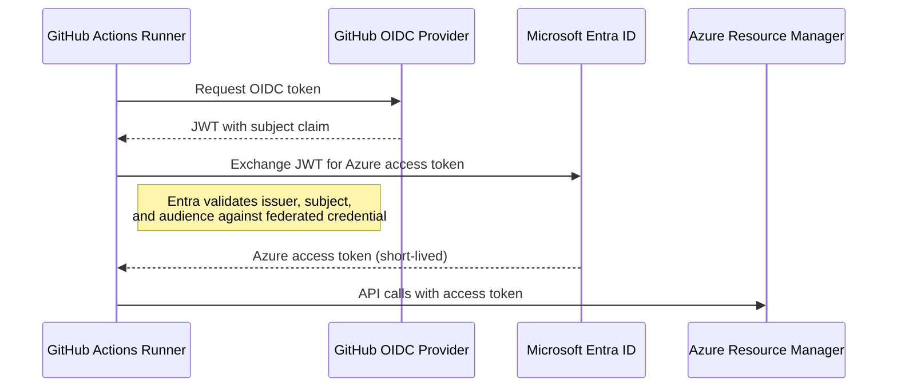

# Authentication & Identity

This document explains how GitHub Actions authenticates to Azure without storing any secrets or credentials.

## Workload Identity Federation

Traditional CI/CD pipelines store a client secret in GitHub Secrets. This creates operational risk: secrets can leak, expire, and need manual rotation.

This project uses [Workload Identity Federation](https://learn.microsoft.com/en-us/entra/workload-id/workload-identity-federation) instead. GitHub Actions presents a short-lived OIDC token, and Azure trusts it directly — no client secrets involved.

## Federated Credentials

A federated credential tells Entra ID: "trust tokens from this specific GitHub repository and context." Each credential matches a **subject claim** pattern in the OIDC token.

This project requires two federated credentials on the same app registration:

| Credential | Subject Claim | Used By |
|------------|--------------|---------|
| Branch-based | `repo:<owner>/<repo>:ref:refs/heads/main` | CI, Terraform workflows |
| Environment-based | `repo:<owner>/<repo>:environment:production` | CD swap-production job |

### Why Two Credentials?

When a GitHub Actions job specifies an `environment:` block, GitHub changes the `sub` (subject) claim in the OIDC token:

- **Without environment**: `repo:myorg/myrepo:ref:refs/heads/main`
- **With environment: production**: `repo:myorg/myrepo:environment:production`

Entra ID performs an exact match on the subject claim. Since the CD pipeline's `swap-production` job references the `production` environment (for the approval gate), its OIDC token has a different subject than the other workflows. Each pattern needs its own federated credential.

## What Gets Stored in GitHub Secrets

Only **identifiers** are stored — never authentication material:

| Secret | Value | Is it sensitive? |
|--------|-------|-----------------|
| `AZURE_CLIENT_ID` | App registration client ID (a GUID) | Not a secret — it's a public identifier |
| `AZURE_TENANT_ID` | Entra ID tenant ID (a GUID) | Not a secret — it's a public identifier |
| `AZURE_SUBSCRIPTION_ID` | Azure subscription ID (a GUID) | Not a secret — it's a public identifier |

These are stored as GitHub Secrets for convenience (to avoid hardcoding them in workflow files), but they are not authentication credentials. The actual authentication happens entirely through the OIDC token exchange.

## Further Reading

- [Workload Identity Federation overview](https://learn.microsoft.com/en-us/entra/workload-id/workload-identity-federation)
- [GitHub OIDC with Azure](https://docs.github.com/en/actions/security-for-github-actions/security-hardening-your-deployments/configuring-openid-connect-in-azure)
- [azure/login action](https://github.com/Azure/login#login-with-openid-connect-oidc-recommended)
