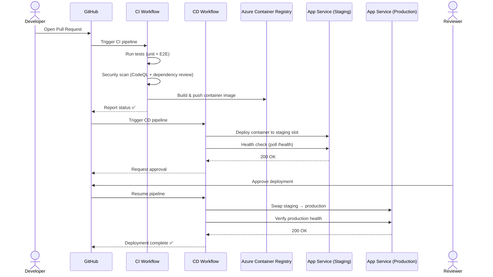
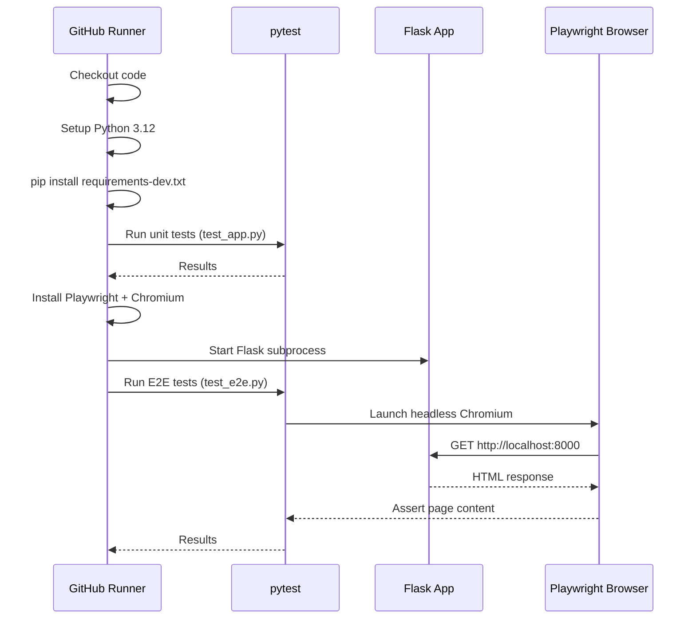
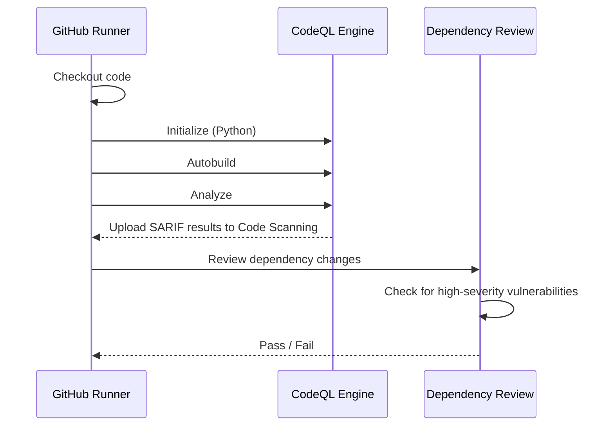
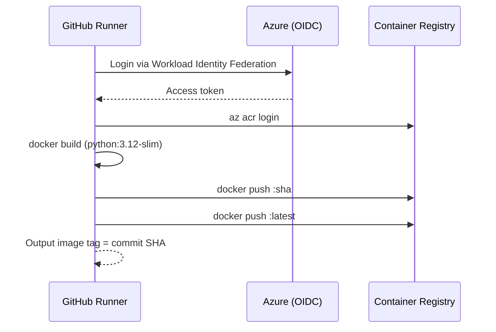
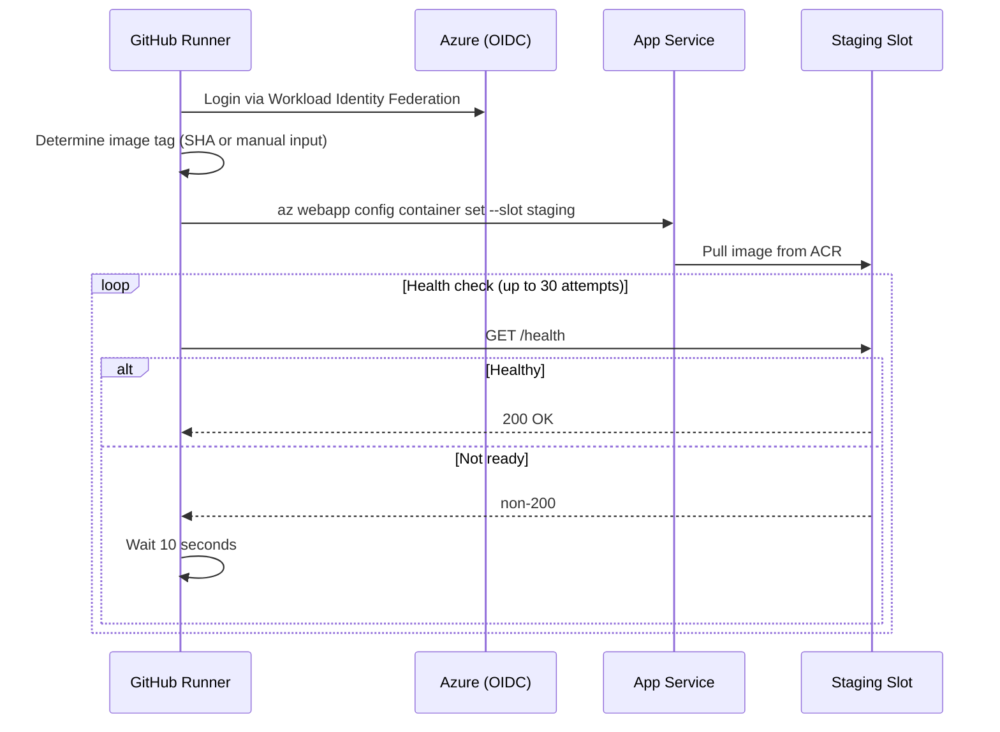
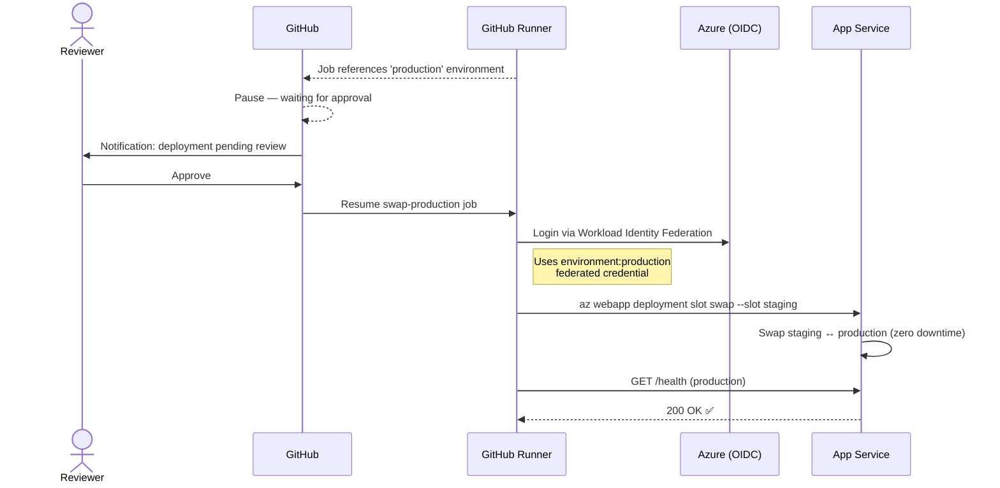
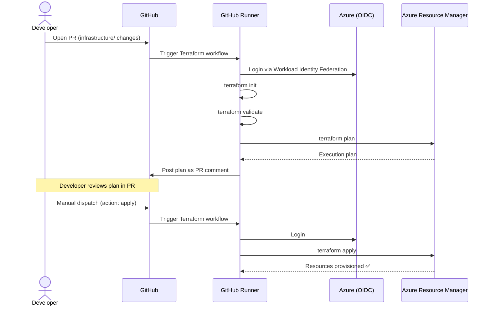

# Pipeline Flow

This document walks through how a code change moves from a developer's pull request all the way to production. Each section covers one phase of the journey.

## End-to-End Overview

## Phase 1: Continuous Integration

When a developer opens a pull request that touches `src/hello-world/` or the CI workflow itself, the CI pipeline runs automatically.

### Test Stage

### Security Stage

Runs only after tests pass. Uses GitHub Advanced Security features.

### Build Stage

Runs only on manual dispatch or merged PRs. Produces the container image.

## Phase 2: Continuous Delivery

The CD pipeline triggers automatically when CI completes successfully, or can be triggered manually with a specific image tag.

### Deploy to Staging

### Approval Gate & Production Swap

## Phase 3: Infrastructure (Terraform)

Infrastructure changes follow a separate workflow, triggered by changes to the `infrastructure/` directory.

